# Alphabeth Handwritting Recognition

Muhammad Rafly Arjasubrata

## Domain Proyek

Pengenalan pola alfabet merupakan tugas penting dalam pengolahan citra dan pemrosesan bahasa alami. Pengenalan pola alfabet memiliki banyak aplikasi yang relevan dalam kehidupan sehari-hari, termasuk dalam OCR (_Optical Character Recognition_) yang membantu mengonversi teks dari gambar menjadi teks yang dapat diedit. Ini bermanfaat dalam pemindaian dokumen, membaca tanda tangan, dan mengenali tulisan tangan, membuat pekerjaan sehari-hari yang melibatkan teks dari gambar menjadi lebih efisien.

[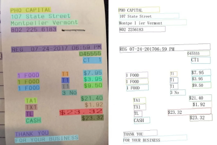](./asset/ocrExample.png)

Variasi tulisan tangan yang berbeda-beda menjadi tantangan utama untuk memecahkan masalah ini. Oleh karena itu, model akan diuji dengan dataset yang berbeda untuk mengevaluasi seberapa baik model mengenali tulisan yang bervariasi dan belum pernah dilihat sebelumnya.

Referensi [1] :

## Business Understanding

### Problem Statement

1. Bagaimana cara mengatasi tantangan mengenali jenis karakter tulisan tangan yang berbeda-beda ?

   Apa metode untuk membedakan karakter tulisan tangan yang beragam dan lebih akurat, apakah penggunaan dataset yang berbeda dapat memecahkan masalah tersebut ?

2. Bagaimana cara meningkatkan akurasi pengenalan karakter dengan kondisi resolusi gambar yang rendah ?

   Apakah ada teknik pengolahan atau pembersihan gambar yang dapat digunakan untuk memperbaiki gambar yang berkualitas rendah ?

3. Bagaimana cara mengimplementasikan model dengan kecepatan tinggi ?

   Apakah ada strategi untuk mengoptimalkan model agar memiliki kecepatan inferensi yang tinggi dan membuat model lebih ringan ?

### Goals

1. Meningkatkan akurasi untuk jenis karakter yang lebih bervariasi.

   - Mengembangkan model yang mampu mengenali karkater tulisan tangan dari berbagai gaya tulisan dan bahasa.
   - Melakukan pelatihan dengan dataset yang dapat mencakup variasi karakter tulisan tangan untuk melatih model dengan baik.
   - `Metrik keberhasilan adalah akurasi pada data uji diatas 80%`.

2. Meningkatkan akurasi pengenalakan karakter dengan kondisi resolusi gambar yang rendah

   - Menggunakan teknik pemrosesan gambar seperti proses konvolusi untuk mendapatkan pola unik dari setiap gambar.
   - Meninjau ukuran gambar yang berbeda agar mendapatkan hasil yang optimal dengan resolusi yang rendah.
   - `Metrik keberhasilan adalah model dilatih dengan resolusi gambar yang lebih kecil ukuran resolusi dari data latih sebenarnya`.

3. Implementasi model dengan kecepatan tinggi.
   - Meninjau kompleksitas layer yang berbeda dalam model.
   - Meninjau jumlah lapisan model yang berbeda.
   - `Metrik keberhasilan adalah waktu inferensi kurang dari 1 detik untuk 10.000 karakter`.

### Solution Statement

1. Solusi untuk meningkatkan akurasi untuk jenis tulisan yang bervariasi.

   Setiap model akan diuji dengan dataset yang berbeda dengan dataset latih dan validasi. Dataset ini memiliki jenis tulisan yang lebih kompleks. Dengan ini, akan diketahui seberapa baik model dalam memprediksi jenis tulisan yang lebih beragam yang belum pernah dilihat sebelumnya.

2. Solusi untuk meingkatkan akurasi pengenalan karakter yang memiliki resolusi rendah

   Setiap model akan ditinjau dengan 3 ukuran resolusi berbeda yang lebih kecil dari ukuran resolusi data latih. Hasil akurasi pada data validasi dan data uji akan ditinjau pada setiap resolusi gambar dan dilihat apakah pengurangan resolusi berdampak pada akurasi yang dihasilkan oleh model.

3. Solusi untuk Implementasi model dengan kecepatan tinggi.

   Waktu inferensi data uji ditinjau untuk mencari model dengan kecepatan tinggi. Ini dilakukan setelah metrik keberhasilan pada goals no.1 dan no.2 terpenuhi.

## Data Understanding

Pada eksperimen ini, model akan ditinjau dengan menggunakan dua dataset berbeda. Dataset pertama digunakan sebagai data latih dan data validasi. Dataset kedua yang memiliki jenis tulisan yang lebih variatif digunakan sebagai data uji.

### Dataset Latih & Validasi

#

Dataset untuk proses pelatihan dan uji menggunakan dataset `Handwritting NIST`. Dataset ini mengandung sejumlah besar karakter tulisan tangan yang dikumpulkan dari berbagai sumber. Tujuan utama dibuatnya dataset ini adalah untuk menguji dan melatih algoritma pengenalan karakter tulisan tangan yang sering digunakan dalam OCR.

Dalam dataset ini, terdapat `372.450` data yang terdiri dari alfabet kapital A-Z yang berukuran `28x28` dan memiliki 1 channel warna.

#### Distribusi setiap label pada dataset

[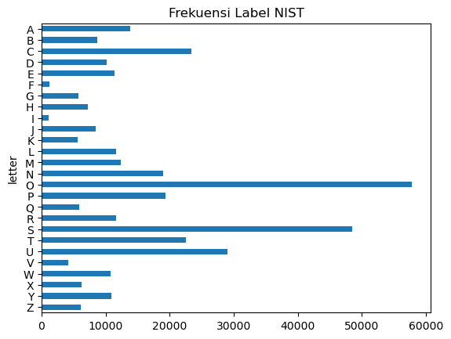](./asset/freqNIST.png)

#### Contoh gambar setiap jenis alfabet dalam dataset

[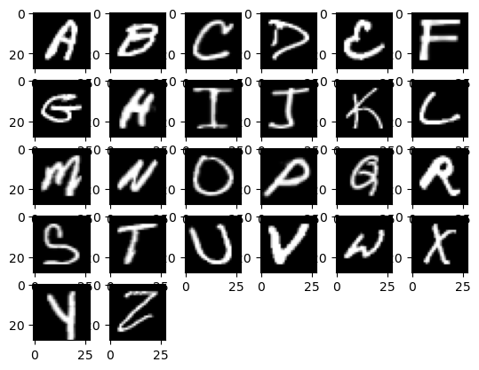](./asset/charNIST.png)

### Dataset Uji

#

Dataset untuk proses pengujian menggunakan dataset `Extended MNIST`. Dataset ini dikembangkan untuk tugas pengenalan tulisan tangan yang lebih umum daripada NIST & MNIST. Dataset ini mencakup alfabet, angka, dan karakter khusus lainnya yang lebih banyak dan variatif. Sehingga dataset ini cocok untuk dijadikan data uji untuk mengetahui generalisasi model.

Dataset ini memiliki `116.322` data yang terdiri dari 0-9 A-Z dan a-z. Terdapat `31.345` jumlah data yang memiliki jenis A-Z yang dijadikan data uji pada model.

#### Distribusi setiap label pada dataset

[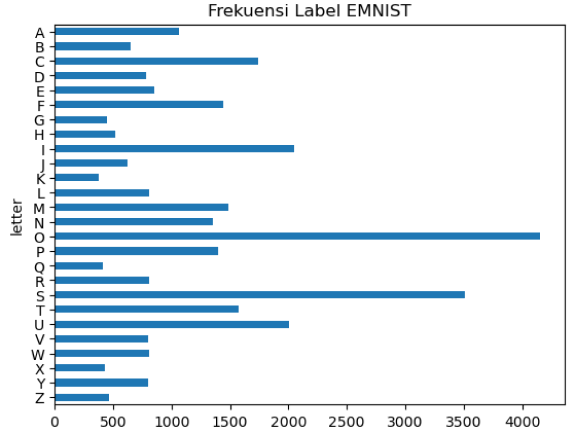](./asset/freqEMNIST.png)

Contoh gambar setiap jenis alfabet dalam dataset

[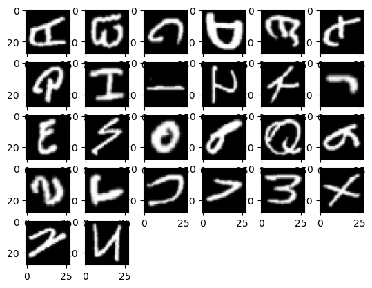](./asset/charEMNIST.png)

## Data Preperation

Beirkut adalah langkah-langkah agar data siap ke tahap modeling.

### Crop & Transform Gambar

Cropping pada gambar dilakukan karena akan ditinjau beberapa ukuran gambar yang lebih kecil dari ukuran gambar asli untuk mengetahui apa dampak pengecilan ukuran gambar.

#### Dataset NIST

Pada dataset NIST, gambar dicrop dengan ukuran tertentu dengan titik tengah sebagai acuan. Ini dilakukan agar feature penting dalam gambar tetap terjaga walaupun gambar sudah dicrop.

Berikut adalah contoh cropping gambar dari dataset NIST dari ukuran `28x28` ke ukuran `20x20`
[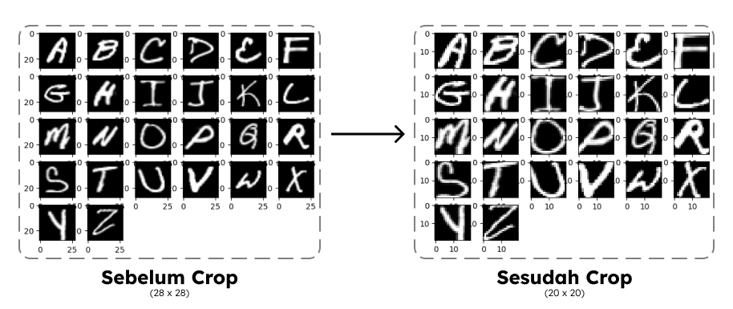](./asset/cropNIST.png)

#### Dataset EMNIST

Dapat dilihat diawal, bahwa orientasi data EMNIST ini tidak sesuai, harus dilakukan rotasi gambar 90 derajat searah jarum jam, kemudian dilakukan flip secara vertikal. Setelah itu lalu gambar dicrop dengan ukuran tertentu dengan titik tengah sebagai acuan.

Berikut adalah contoh transformasi & cropping gambar dari dataset EMNIST dari ukuran `28x28` ke `20x20`.
[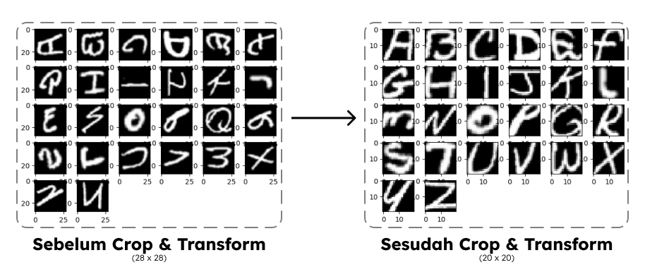](./asset/cropEMNIST.png)

### Feature Extraction

Fitur dan label pada dataset `NIST` displit menjadi `x` dan `y`, dimana `x` merepresentasikan fitur dan `y` merepresentasikan label. Pada dataset `EMNIST`, data displit menjadi `xTest` dan `yTest`, dimana `xTest` merepresentasikan fitur dan `yTest` merepresentasikan label.

### Split data Training & Validasi

Split data training dan validasi menggunakan bantuan `train_test_split` dari modul [Sci-kit Learn](https://scikit-learn.org/stable/).

Rasio data validasi sebesar `5%` dari dataset NIST, sedangkan sisanya dijadikan data training. Ini berarti data latih memiliki jumlah `353.827` dan data validasi sebanyak `18.623`.

Fitur dari data latih direpresentasikan sebagai `xTrain` dan label dari data latih direpresentasikan sebagai `yTrain`. Sedangkan untuk fitur dari data validasi direpresentasi kan oleh `xVal` dan untuk label dari data validasi direpresentasikan dengan `yVal`.

### Normalisasi

Normalisasi dilakukan dengan membagi seluruh nilai piksel pada feature yang meliputi `xTrain`, `xVal`, dan `xTest` dengan `255`. Ini dilakukan karena pada gambar, nilai intensitas piksel direpresentasikan dari `0-255`, dimana 0 merepresentasikan piksel gelap, sedangkan 255 merepresentasikan piksel terang.

### One-Hot Encoding

One-hot encoding dilakukan karena model neural network memerlukan representasi label dalam bentuk vektor biner
| Label | Label One-Hot Encoded |
| :------: | ------ |
| 2 | [0,1,0,0] |
| 1 | [1,0,0,0] |
| 4 | [0,0,0,1] |

Hasil one-hot encoding direpresentasikan oleh sebuah vektor. Vektor yang bernilai 1 menunjukkan kategori yang benar-benar sesuai label, sementara element lainnya bernilai 0.

## Modeling

Setiap model akan dilaith dengan jumlah epoch `8` dan batch size `16`. Seluruh model di-compile dengan optimizer Adamax, dimana ini merupakan gabungan variasi dari algoritma optimasi Adam (Adaptive Moment Estimation) yang menggabungkan algoritma RMSprop dan AdaGrad [2].

### Deep Neural Network

Pembuatan model `Deep Neural Network` dibuat dengan model Sequential dengan bantuan modul [Tensorflow](https://www.tensorflow.org/) dan [Keras](https://keras.io/).

Parameter yang ditinjau dalam model ini adalah jumlah hidden layer dan jumlah preceptron pada hidden layer tersebut. Beberapa parameter yang akan ditinjau akan dilatih dan dievaluasi menggunakan metode `grid search`. Berikut adalah parameter yang akan ditinjau.

| Jumlah Layer | Jumlah Preceptron |
| :----------: | ----------------- |
|      1       | 64                |
|      2       | 64                |
|      1       | 128               |
|      2       | 128               |
|      1       | 256               |
|      2       | 256               |

Dengan meninjau jumlah layer yang berbeda, model dapat memungkinkan untuk memahami tingkat abstraksi yang berbeda dari data, sedangkan jumlah preceptron yang berbeda dapat mempengaruhi kapasitas model untuk menangkap pola yang kompleks.

Seluruh hidden layer memiliki activation function `Rectified Linear Unit`. Input layer memiliki ukuran array 2 dimensi sesuai ukuran gambar yang sudah dicrop. Setelah setiap hidden layer, akan diberikan `Dropout` sebesar `0.2` untuk mencegah overfitting. Input layer ini berjenis `flatten` agar gambar diubah menjadi array 1-dimensi.

Output layer pada model DNN memiliki jenis layer `Dense` dengan `26 Preceptron`, dimana setiap preceptron ini mewakili satu kelas yang ada. Activation function dari layer ini adalah `Softmax` dimana preceptron dengan nilai tertinggi yang berarti punya kemungkinan tertinggi diubah menjadi 1, sedangkan sisanya 0.

### Convolutional Neural Network

Tambahan layer `Convolutional` dalam model DNN juga menggunakan bantuak modul [Tensorflow](https://www.tensorflow.org/) dan [Keras](https://keras.io/). Model DNN yang menghasilkan akurasi terbaik pada data uji MNIST akan diuji kembali dengan tambahan layer `Convolutional`. Layer `MaxPooling` juga digunakan pada setiap layer konvolusi untuk mereduksi dimensi dari gambar yang sudah dilakukan proses konvolusi.

Ukuran kernel dalam layer konvolusi berukuran `3x3` dan ukuran Pooling pada layer MaxPooling berukuran `2x2`. Terdapat beberapa parameter yang ditinjau dalam layer konvolusi, yaitu sebagai berikut :

| Jumlah Layer | Jumlah Kernel |
| :----------: | ------------- |
|      1       | 16            |
|      2       | 16            |
|      1       | 32            |
|      2       | 32            |
|      1       | 64            |
|      2       | 64            |

Dengan meninjau jumlah layer konvolusi yang berbeda, model dapat memungkinkan untuk mengekstraksi fitur yang berbeda dari data. Sementara jumlah kernel yang berbeda mempengaruhi berapa banyak pola yang dapat dikenali oleh model dalam setiap layer konvolusi.

Sama seperti hidden layer, convolutional layer juga memiliki activation function `Rectified Linear Unit`. Diharapkan dengan adanya layer convolutional ini, terdapat ciri-ciri unik tertentu dari setiap kelas yang dapat diidentifikasi dengan layer convolutional dan meningkatkan akurasi dan generalisasi model.

## Evaluasi

Setiap model dan parameter akan diujikan dengan 4 ukuran gambar yang berbeda untuk melihat perbedaan nilai akurasi pada setiap ukuran, ukuran yang ditinjau adalah `28x28` (ukuran asli), `22x22`, `20x20` dan `18x18`.

Hal tersebut dilakukan agar menemukan model yang memiliki akurasi baik dan melakukan prediksi dengan resolusi gambar yang kecil. Ini berakibat pada performa model yang lebih responsif dan kemampuan untuk mendeteksi tulisan dengan resolusi yang kecil.

### Hasil Model Deep Neural Network

Waktu latih berdasarkan proses pelatihan yang dilakukan menggunakan Apple M1 (8c).

#### 28 x 28

#

| Preceptron | Layer | Val Acc | Test Acc | Params | Train Time (s) |
| ---------: | :---: | ------- | -------- | ------ | ------------------------- |
|         64 |   1   | 95.494  | 80.516   | 51930  | 95.865                    |
|         64 |   2   | 96.967  | 80.899   | 56090  | 102.841                   |
|        128 |   1   | 97.197  | 81.977   | 103834 | 108.465                   |
|        128 |   2   | 97.476  | 83.254   | 128346 | 122.900                   |
|        256 |   1   | 97.852  | 83.053   | 207642 | 144.566                   |
|        256 |   2   | 98.394  | `84.421` | 273434 | 212.115                   |

#### 22 x 22

#

| Preceptron | Layer | Val Acc | Test Acc | Params | Train Time (s) |
| ---------: | :---: | ------- | -------- | ------ | ------------------------- |
|         64 |   1   | 95.618  | 80.829   | 32730  | 73.867                    |
|         64 |   2   | 95.527  | 81.527   | 36890  | 81.490                    |
|        128 |   1   | 97.121  | 82.373   | 65434  | 102.338                   |
|        128 |   2   | 97.401  | 83.152   | 81946  | 116.296                   |
|        256 |   1   | 97.819  | 83.684   | 130842 | 118.916                   |
|        256 |   2   | 98.378  | `84.929` | 196634 | 187.712                   |

#### 20 x 20

#

| Preceptron | Layer | Val Acc | Test Acc | Params | Train Time (s) |
| ---------: | :---: | ------- | -------- | ------ | ------------------------- |
|         64 |   1   | 95.580  | 80.973   | 27354  | 72.697                    |
|         64 |   2   | 95.811  | 81.416   | 31514  | 79.076                    |
|        128 |   1   | 97.041  | 83.190   | 54682  | 95.997                    |
|        128 |   2   | 97.449  | 83.898   | 71194  | 111.753                   |
|        256 |   1   | 97.878  | 84.334   | 109338 | 113.912                   |
|        256 |   2   | 98.372  | `85.389` | 175130 | 180.940                   |

#### 18 x 18

#

| Preceptron | Layer | Val Acc | Test Acc | Params | Train Time (s) |
| ---------: | :---: | ------- | -------- | ------ | ------------------------- |
|         64 |   1   | 95.349  | 78.289   | 22490  | 71.774                    |
|         64 |   2   | 95.618  | 78.647   | 26650  | 77.644                    |
|        128 |   1   | 97.788  | 80.303   | 44954  | 87.037                    |
|        128 |   2   | 97.245  | 81.467   | 61466  | 103.199                   |
|        256 |   1   | 97.589  | 81.818   | 89882  | 110.941                   |
|        256 |   2   | 98.195  | `83.155` | 115674 | 187.016                   |

Dapat dilihat dari seluruh resolusi yang ditinjau, model DNN dengan jumlah layer 2 dengan jumlah preceptron 256 memiliki nilai akurasi terbaik.

Berikut adalah graf antara jumlah parameter model dan hasil akurasi model dengan parameter jumlah preceptron sebesar `256`.

[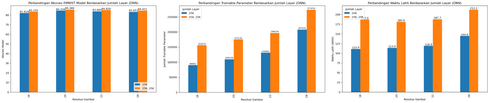](./asset/paramsDNN.png)

Dapat dilihat dari 2 graf diatas, perbandingan jumlah parameter antara jumlah preceptron sebanyak 256 dengan `1 layer` dan `2 layer` cukup signifikan. Semakin banyak jumlah parameter, maka semakin lama model untuk melakukan prediksi.

Namun, dilihat dari graf akurasi pada dataset `EMNIST`, nilai akurasi pada seluruh resolusi gambar yang ditinjau, model yang menggunakan `2 layer` selalu lebih besar dibanding dengan model yang menggunakan `1 layer`. Namun, perbedaan tersebut tidak terlalu signifikan. Maka `Model Dengan 1 Layer [256]` akan ditinjau lebih lanjut menggunakan metode `Convolutional`.

Hal tersebut dilakukan agar model dapat melakukan prediksi dengan cepat dan mengurangi waktu tunggu prediksi yang merupakan salah satu masalah yang coba dipecahkan dalam masalah ini.

## Hasil Model Convolutional Neural Network

Waktu latih berdasarkan proses pelatihan yang dilakukan menggunakan NVIDIA Tesla T4 (Google Colab)

#### 28 x 28

#

| Kernel | Layer | Val Acc | Test Acc | Params  | Train Time (s) |
| -----: | :---: | ------- | -------- | ------- | ------------------------- |
|     16 |   1   | 98.974  | 84.517   | 699322  | 746.951                   |
|     16 |   2   | 98.990  | 88.719   | 111818  | 808.116                   |
|     32 |   1   | 99.033  | 84.916   | 1391706 | 698.786                   |
|     32 |   2   | 99.162  | 88.849   | 221306  | 807.602                   |
|     64 |   1   | 99.178  | 84.208   | 2776474 | 746.025                   |
|     64 |   2   | 99.258  | `89.063` | 454106  | 784.800                   |

#### 22 x 22

#

| Kernel | Layer | Val Acc | Test Acc | Params  | Train Time (s) |
| -----: | :---: | ------- | -------- | ------- | ------------------------- |
|     16 |   1   | 98.920  | 87.599   | 416698  | 797.404                   |
|     16 |   2   | 98.824  | 87.631   | 74954   | 803.844                   |
|     32 |   1   | 99.167  | 87.886   | 826458  | 744.888                   |
|     32 |   2   | 99.071  | 87.765   | 147578  | 869.488                   |
|     64 |   1   | 99.130  | 88.179   | 1645978 | 804.711                   |
|     64 |   2   | 99.237  | `88.483` | 306650  | 848.853                   |

#### 20 x 20

#

| Kernel | Layer | Val Acc | Test Acc | Params | Train Time (s) |
| -----: | :---: | ------- | -------- | ------ | ------------------------- |
|     16 |   1   | 98.952  | 87.267   | 338874 | 720.644                   |
|     16 |   2   | 98.131  | 85.835   | 46282 | 769.242                    |
|     32 |   1   | 99.071  | 87.608   | 670810 | 772.380                   |
|     32 |   2   | 98.421  | 85.506   | 90234 | 771.204                    |
|     64 |   1   | 99.199  | `87.363` | 1334682 | 768.286                  |
|     64 |   2   | 98.807  | 86.559   | 191962 | 763.260                   | 

#### 18 x 18

#

| Kernel | Layer | Val Acc | Test Acc | Params | Train Time (s) |
| -----: | :---: | ------- | -------- | ------ | ------------------------- |
|     16 |   1   | 98.738  | 86.409   | 269242 | 753.195                   |
|     16 |   2   | 98.405  | 85.576   | 46282 | 761.922                    |
|     32 |   1   | 98.947  | 86.103   | 531546 | 778.295                   |
|     32 |   2   | 98.764  | 86.074   | 90234 | 787.420                    |
|     64 |   1   | 99.071  | `86.358` | 1056154 | 766.796                  |
|     64 |   2   | 99.065  | 86.348   | 191962 | 786.438                   | 

Pada model yang dilatih dengan gambar dengan resolusi `28 x 28` dan `22 x 22`, akurasi dengan 2 layer konvolusi dengan jumlah kernel yang sama selalu lebih besar dibanding akurasi model dengan 1 layer konvolusi.

[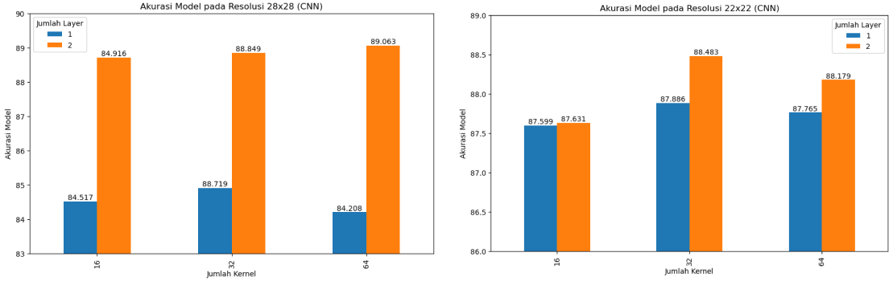](./asset/28-22CNN.png)

Namun, pada model yang dilatih dengan resolusi `20 x 20`, dan `18 x 18`, nilai akurasi dengan 1 layer konvolusi pada model ini lebih tinggi dibanding model dengan 2 layer konvolusi dengan jumlah kernel yang sama.

[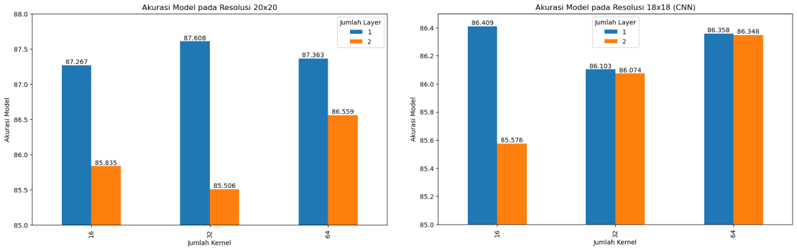](./asset/18-20CNN.png)

### Kesimpulan Hasil

Berdasarkan hasil diatas, model DNN dengan parameter hidden layer sebanyak `1 layer` dense dengan jumlah `preceptron 256` ditinjau lebih lanjut menggunakan CNN karena perbedaan hasil dengan model `2 layer` dense dengan jumlah `preceptron 256` tidak begitu signifikan, sedangkan ukuran model cukup jauh lebih berat. Model dengan `1 layer` dense dengan jumlah `preceptorn 256` pada resolusi `20 x 20` akan dilakukan evaluasi lebih lanjut.

Pada model CNN, model yang ditinjau dengan ukuran resolusi gambar `20 x 20` dan `18 x 18` dengan `1 layer konvolusi ` dan `jumlah kernel 64` memiliki akurasi yang lebih besar dibanding dengan model yang dibuat oleh `1 layer konvolusi` dengan jumlah kernel yang sama. Ini dapat disimpulkan bahwa dengan mengurangi resolusi gambar, layer konvolusi yang diperlukan berkurang untuk mencapai hasil yang optimum. Maka model dengan `1 layer konvolusi` dan `jumlah kernel 64` pada resolusi `20 x 20` akan ditinjau lebih lanjut.

## Evaluasi Lanjutan

Berikut adalah penjelasan metrik evaluasi yang digunakan dalam evaluasi lanjutan

1. Precision

   Precision mengukur sejauh mana prediksi yang positif benar-benar bernilai True. Dalam konteks pengenalan tulisan tangan, precision akan memberi tahu seberapa akurat model dalam mengidentifikasi tulisan tangan tertentu.

   Misalnya, berapa presentasi dari karakter `A` yang diprediksi dengan benar sebagai `A` dari total karakter `A` yang diprediksi.

   $Precision = \frac{True Positive}{True Positive + False Positive}$

2. Recall

   Recall mengukur sejauh mana model dapat mengidentifikasi semua kasus positif sebenarnya. Dalam konteks pengenalan tulisan tangan, precision akan memberi tahu seberapa akurat model dalam mengidentifikasi karakter tulisan tangan tertentu.

   Misalnya, berapa presentasi karakter `A` yang berhasil diidentifikasi dari total karakter `A` yang sebenarnya dalam dataset.

   $Recall = \frac{True Positive}{True Positive + False Negative}$

3. F1 Score

   F1 Score adalah pengukuran gabungan dari precision dan recall yang memberikan gambaran lebih lengkap tentang kinerja model. F1 score berguna ketika perlu menjaga keseimbangan antara precision dan recall.

   Nilai ini digunakan ketika ada trade-off antara percision dan recall. Ini membantu menghindari situasi dimana model memiliki precision yang sangat tinggi tetapi recall yang rendah atau sebaliknya.

   $F1 Score = 2 . (\frac{Precision . Recall}{Precision + Recall})$

### Evaluasi Lanjutan Pada Model DNN Terbaik (20x20)

Evaluasi lanjutan pada model DNN dengan `1 layer` dense dengan jumlah `preceptron 256`. Model ini memiliki,

Akurasi pada Data Validasi : `97.836%`

Akurasi pada Data EMNIST : `84.334%`

[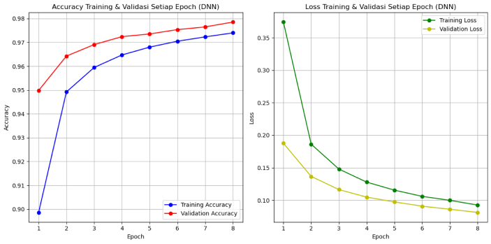](./asset/accLossDNN.png)

Model ini memiliki waktu prediksi data EMNIST selama `0.542s`. Yang berarti model dapat memprediksi sekitar `58000 gambar per detik`. Ini sudah memenuhi metrik keberhasilan waktu inferensi.

Model ini juga sudah memiliki akurasi pada data uji `diatas 80%`, yang berarti sudah memenuhi metrik keberhasilan akurasi. Model ini memperoleh akurasi tersebut pada gambar dengan ukuran `20 x 20` yang model dilatih dengan resolusi gambar kurang dari resolusi data latih yang sebenarnya. Ini sudah memenuhi metrik keberhasilan akurasi pada gambar dengan resolusi rendah.

Berikut adalah `Confusion Matrix` dari model DNN

[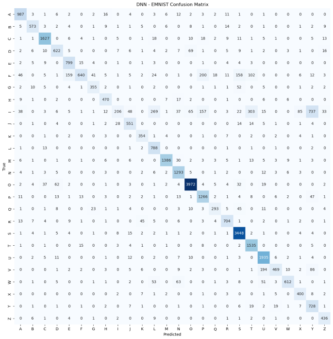](./asset/cmDNN.png)

Dapat dilihat dari confusion matrix diatas, model banyak membuat keasalahan pada label I dan F. Ini dibuktikan dengan nilai recall yang rendah.

[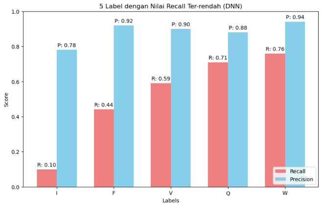](./asset/recallDNN.png)

Nilai recall yang rendah mengindikasikan bahwa model cenderung tidak mengenali sebagian besar karakter `I` yang sebenarnya. Ini dapat mengakibatkan kinerja yang kurang baik dalam situasi dimana mengindentifikasi semua karakter `I` sebenarnya sangat penting.

Namun nilai precision yang tinggi mengindikasikan semua karakter yang diprediksi sebagai `I`, sebagian besar memang karakter `I` yang sebenarnya. Tren ini juga terjadi pada beberapa label seperti `F` dan `V`.

[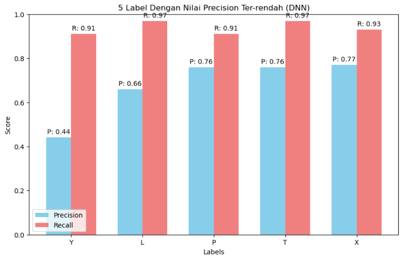](./asset/precisionDNN.png)

Dari graf diatas juga menunjukkan terdapat beberapa label dengan nilai precision yang rendah, namun memiliki nilai recall yang tinggi. Ini mengindikasikan bahwa model cenderung mengidentifikasi beberapa label seperti `Y` dan `L` cenderung mampu mengidentifikasi sebagian besar karakter tersebut yang sebenarnya ada dalam data. Ini mengindikasikan bahwa model memiliki kemampuan baik memprediksi huruf tersebut.

Namun nilai precision yang rendah mengindikasikan bahwa model membeirkan banyak prediksi False Positive untuk beberapa label dalam graf diatas.

Berikut adalah 5 label dengan nilai F1 Score ter-rendah

[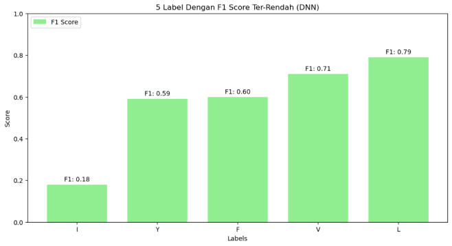](./asset/f1DNN.png)

Dapat dilihat, 5 label dengan f1 score ter-rendah ini diakibatkan dari rendahnya nilai recall atau precision. Karena 5 label tersebut juga muncul dalam graf 5 label dengan recall atau precision ter-rendah.

Berikut adalah rata-rata dari setiap metrik evaluasi

[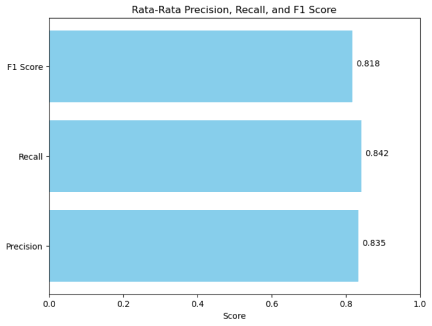](./asset/avgDNN.png)

Dapat dilihat dari nilai rata-rata setiap metrik evaluasi, Model sudah dapat memprediksi keseluruhan label dengan cukup baik, kesalahan hanya terjadi di beberapa label, namun kesalahan tersebut cukup buruk.

### Evaluasi Lanjutan Pada Model CNN Terbaik (20x20)

Evaluasi lanjutan pada model CNN dengan `1 layer` konvolusi dengan jumlah `kernel 64`.

Akurasi pada Data Validasi : `98.432`

Akurasi pada Data EMNIST : `87.363`

[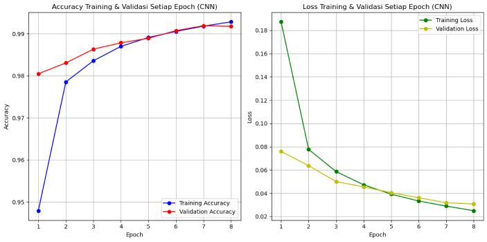](./asset/accLossCNN.png)

Model ini memiliki waktu prediksi data EMNIST selama `1.827s`. Yang berarti model dapat memprediksi sekitar `17000 gambar per detik`. Ini sudah memenuhi metrik keberhasilan waktu inferensi.

Model ini juga sudah memiliki akurasi pada data uji `diatas 80%`, yang berarti sudah memenuhi metrik keberhasilan akurasi. Model ini memperoleh akurasi tersebut pada gambar dengan ukuran `20 x 20` yang model dilatih dengan resolusi gambar kurang dari resolusi data latih yang sebenarnya. Ini sudah memenuhi metrik keberhasilan akurasi pada gambar dengan resolusi rendah.

Berikut adalah `Confusion Matrix` dari model CNN

[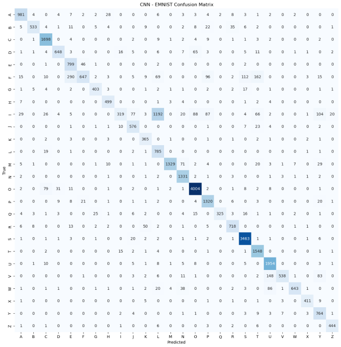](./asset/cmCNN.png)

Dapat dilihat dari confusion matrix model CNN diatas, model masih membuat banyak kesalahan pada label `I` dan `F`. Namun kesalahan tersebut menjadi terpusat, dimana model banyak memprediksi `I` sebagai `L` dan `F` sebagai `S`, `T`, dan `P`.

Hal tersebut didukung oleh nilai recall berikut

[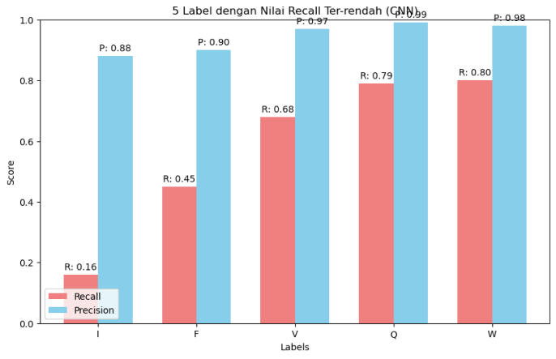](./asset/recallCNN.png)

5 Label dengan recall ter-rendah masih ditempati oleh label yang sama dengan DNN. Namun baik nilai recall dan precision memiliki nilai yang lebih tinggi dari hasil prediksi model DNN. Ini berarti model CNN dapat mengurangi kesalahan FN dibandingkan model DNN.

[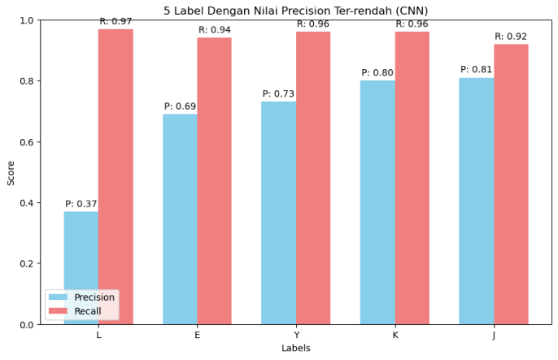](./asset/precisionCNN.png)

Pada label `L`, nilai precision jauh lebih kecil pada model CNN dibandingkan DNN namun tetap memiliki recall yang sama. Ini mungkin disebabkan oleh layer kovolusi yang dapat menghasilkan respons yang lebih banyak terhadap berbagai fitur dan pola.

[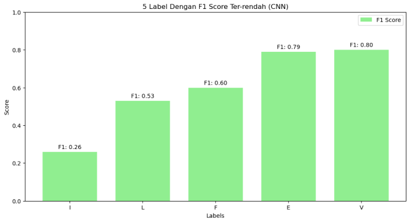](./asset/f1CNN.png)

Dari grafik 5 label dengan f1-score ter-rendah, label `I` masih memiliki nilai f1-score ter-rendah. Namun angka ini meningkat dari model DNN yang memiliki nilai `0.18` menjadi `0.26`.

Berikut adalah rata-rata nilai evaluasi metrik pada model CNN

[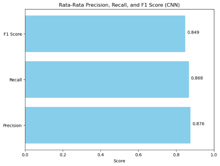](./asset/avgCNN.png)

Dapat dilihat, terdapat peningkatan pada setiap metrik evaluasi pada model CNN, tetapi peningkatan tersebut tidak signifikan. Ini menunjukkan bahwa penambahan layer konvolusi tidak terlalu efektif.

## Kesimpulan

- Model Deep Neural Network dengan hidden layer sebanyak 1 layer dengan jumlah preceptron 256 yang dilatih dengan menggunakan data dengan resolusi 20 x 20 meruppakan model Deep Neural Network terbaik. Model ini dilatih dengan resolusi yang lebih kecil dari data asli dan sudah memiliki akurasi 84.334% pada data EMNIST yang sudah melebihi parameter keberhasilan akurasi model. Model ini juga memiliki kecepatan inferensi 58000 gambar per detik yang sudah jauh melebihi parameter keberhasilan waktu inferensi.

- Model Convolutional Neural Network dengan layer konvolusi sebanyak 1 layer dengan jumlah kernel 64 yang dilatih dengan menggunakan data dengan resolusi 20 x 20 merupakan model Convolutional Neural Network terbaik. Model ini dilatih dengan resolusi yang lebih kecil dari data asli dan sudah memiliki akurasi 87.363% pada data EMNIST yang sudah melebihi parameter keberhasilan akurasi model. Model ini juga memiliki kecepatan inferensi 17000 gambar per detik yang sudah melebihi parameter keberhasilan waktu inferensi.

- Dapat disimpulkan bahwa model Deep Neural Network merupakan model terbaik. Ini dikarenakan waktu inferensi yang jauh lebih singkat dan akurasi yang tidak begitu jauh.

- Baik model DNN can CNN memiliki kesulitan mengklasifikasikan label 'I' dan 'F'. Label 'I' dan 'F' memiliki false positive yang sedikit, namun model melewatkan banyak huruf 'I' dan 'F' yang seharusnya diidentifikasi. Ini disimpulkan dari nilai precision pada label 'I' dan 'F' yang tinggi, sedangkan nilai recall sangat rendah.

## Rekomendasi

Berdasarkan penelitian yang sudah dilakukan, berikut adalah rekomendasi untuk penelitian selanjutnya :

1. Penelitian yang lebih lanjut pada resolusi gambar yang lebih tinggi

   Melakukan eksperimen dengan menggunakan gambar beresolusi lebih tinggi untuk melihat apakah model CNN masih memberikan peningkatan yang signifikan dari model DNN dalam akurasi tanpa mengorbankan kompleksitas.

2. Augmentasi data

   Untuk meningkatkan akurasi pengenalan karakter seperti 'I' dan 'F, penelitian lebih lanjut dapat mempertimbangkan augmentasi data khusus untuk karakter-karakter ini atau pemilihan arsitektur yang berebda.

3. Evaluasi pada dataset yang lebih besar

   Selain DNN can DNN, eksperimen dapat dilakukan dengan metode lain seperti RNN, atau transformer-based model untuk melihat apakah metode tersebut dapat memberikan peningkatan performa.

4. Penggunaan Transfer Learning

   Melakukan transfer learning dari model yang sudah ada untuk OCR dapat menjadi opsi untuk eksperimen selanjutnya.

## Referensi

[1] D. Amirtharaj, "COMPUTER VISION: ML 574 Project 3," 2019.

[2] R. Patel and S. Patel, "A Comprehensive Study of Applying Convolutional Neural Network for Computer Vision," International Journal of Advanced Science and Technology, vol. 29, no. 6s, pp. 2161-2174, 2020. ISSN 2005-4238.

[3] K. Jarrett, K. Kavukcuoglu, M. A. Ranzato, and Y. Lecun, "What is the Best Multi-Stage Architecture for Object Recognition?" in Proceedings of the International Conference on Computer Vision (ICCV), 2009, pp. 10.1109/ICCV-2009.
